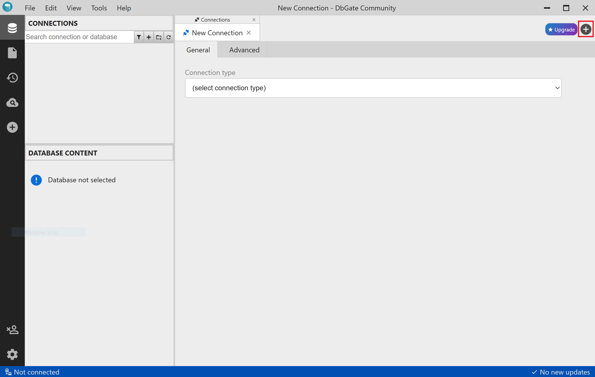
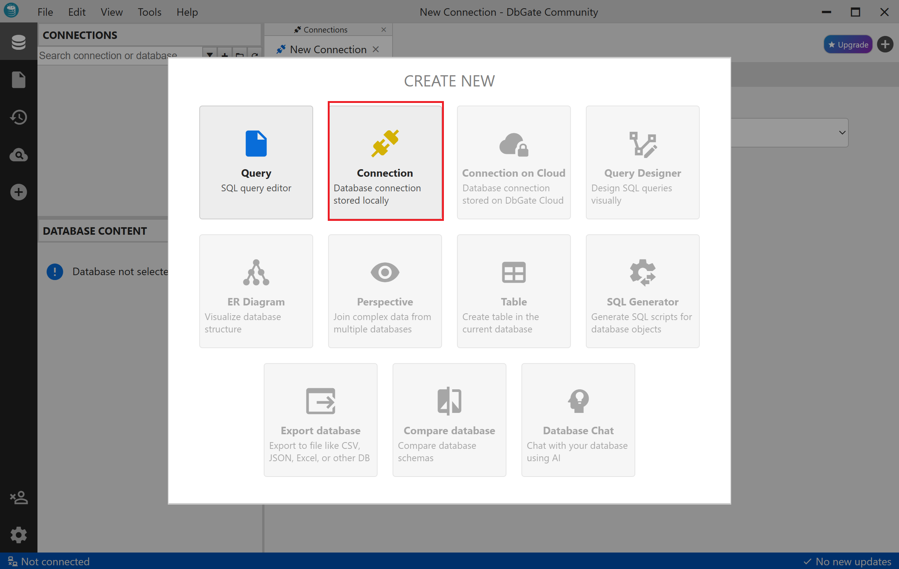
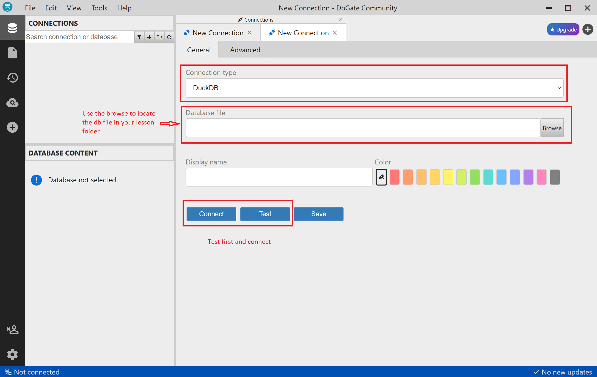

# Connect DuckDB using DbGate

To open a DuckDB file in DbGate:
- Launch DbGate: Open the DbGate application on your desktop.
- Navigate to Connections: In the DbGate interface, locate the section for managing database connections.

- Add a New Connection: Select the option to add a new connection.

- Choose DuckDB: From the list of available database types, select "DuckDB."
- Specify File Path: Provide the full path to your .duckdb file. This can be an existing file or a path where a new DuckDB database will be created if it doesn't exist.
- Test Connection: You can test your connection.
- Connect: Initiate the connection to the DuckDB database file.

- Once connected, you can perform various operations within DbGate, including:
        - Browsing and editing table data.
        - Executing SQL queries in the query console.
        - Importing and exporting data in various formats.
         -Utilizing advanced data tools like the Data Deployer for synchronization.