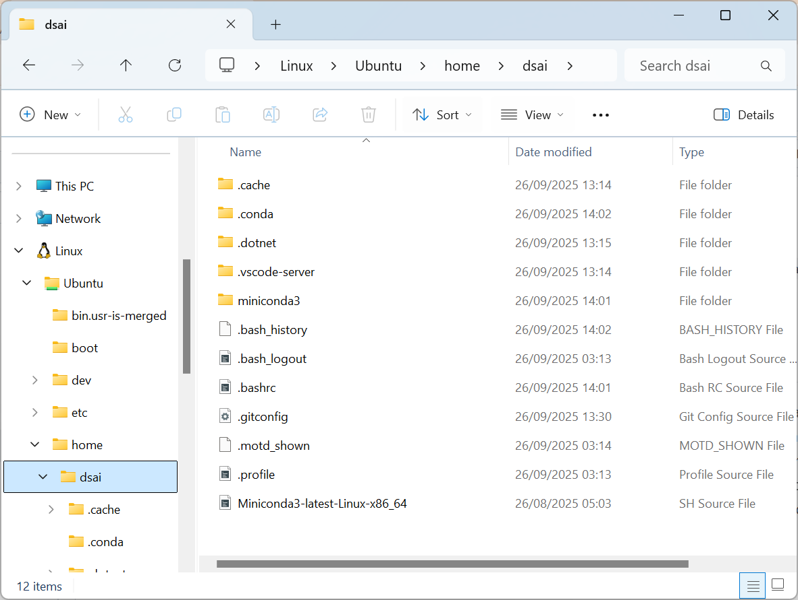

# WSL - Basic Usage

## Basic Linux Command

- Display the current path of your directory
```bash
pwd
```

- List non-hidden files and folders of the current directory
```bash
ls
```

- List all files and folders of the current directory including hidden files and folders
```bash
ls -al
```

You can find the directory at 



- Navigate to a root directory
```bash
cd /
```

- Navigate to home folder from root directory
```bash
cd home/*your_linux_id*

# Example
cd home/dsai
```

- Alternatively, we can also use the following command to cd to home folder represent by (`~`):
```bash
cd ~
```

- Navigate to previous folder
```bash
cd ..
```

### Video 
- [WSL Linux Basics](https://drive.google.com/file/d/1_mPUT7KmauhIilT_T6oQOaZWC4pnFawk/view?usp=drive_link)


