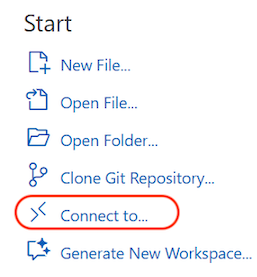
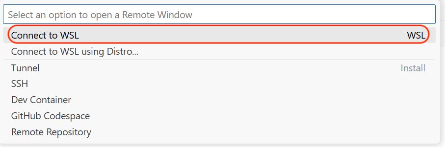
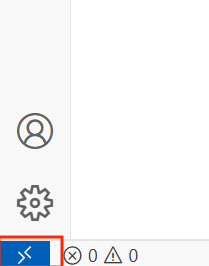
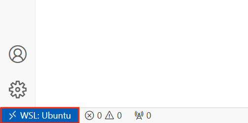

# Module 1 First-Time Software Installation

## Hardware Requirements
- Desktop/laptop computer running the latest version of macOS/Linux/Windows operating system (OS)
- Recommended 16GB onboard memory (RAM) 
- Recommended 50GB available hard disk storage space (HDD/SSD)
- Webcam and microphone for online Zoom sessions

## Software Requirements

- WSL (for Windows users only)
- Visual Studio Code (VSCode) or any source code editor
- Git Command-Line Interface (CLI)
- Conda/Miniconda
- DBeaver database viewer

## WSL for Windows

### *For Windows users only* - Windows Subsystem for Linux (WSL)

Windows users should install WSL which allows you to run Windows and Linux at the same time on a Windows machine. WSL allows you to install a Linux distribution (e.g. Ubuntu, OpenSUSE, Kali, Debian, etc.) and use Linux applications and utilities such as command-line (CLI) tools. 

Most software engineering and development tools are initially developed for Linux and then adapted for Windows. As a result, they often perform better on Linux. Although Windows versions of popular tools are widely available, we strongly recommend using the Linux version whenever possible for optimal performance.
You must be running Windows 11 or 10 version 2004 and higher. 

Follow the instructions [here](https://learn.microsoft.com/en-us/windows/wsl/install) to install Ubuntu on WSL.

You can access your WSL files using regular Windows applications, such as File Explorer. While you in your Linux directory, type: 

`explorer.exe .`

Read this [tutorial](https://learn.microsoft.com/en-us/windows/wsl/filesystems) to find out how it works.

For a step by step installation instruction guide, please refer to [here](guides/install_wsl.md).

For a very basic usage guide, please refer to [here](guides/wsl_linux_basics.md)

Please refer to [Reference - WSL on Windows](reference.md#wsl-on-windows) for more learning resource on WSL.

## Visual Studio Code (VSCode)

You will need a code editor to write Python or SQL code in the course. VSCode is a popular source code editor used by developers for writing, debugging and editing code across various programming languages. 

Download and install VSCode [here](https://code.visualstudio.com/download).


[Video: Install VSCode for Mac and Windows User](https://drive.google.com/file/d/15s22OloEAY3SMtiFE_uSjCiM73cZD9nW/view?usp=drive_link)


### Install the following vscode extensions

Go to the `Extensions` tab, search for the following extensions in the marketplace and install them:

- Python
- Jupyter
- WSL (*Windows user only*)

> Windows WSL users, install the Windows version as VSCode will work across both Windows and WSL environments.

### Windows Users Connecting to WSL in VSCode
Windows WSL users, you can connect to WSL in VScode using the `Connect to` in the `Welcome Page` and select `WSL`. 



and select `WSL`



Alternatively, you can also click on the lower left corner of the screen.



Select `WSL` at the top panel. Once WSL is launched, you should see your lower right corner as shown:



> Note: Please note that you may need to reinstall the Python and Jupyter extensions into the WSL environment. 

[Video: Connect WSL in VSCode](https://drive.google.com/file/d/1BbKKiy_VsBnEd8Y8Ar89zBSHpC_3w-4V/view?usp=drive_link)

#### Windows User: Alternative Way to Connect VSCode to WSL
There is an alternative way to connect WSL to VSCode using command. Using the command method, the entire home folder is opened in VSCode. You do not need to open individual git folder. The advantage is that you do not need to open and close each repository. However, the downside is that it does not provide isolation for each repository.

Here is the process to connect WSL with VSCode using command:

1. Launch `WSL`.
2. At `WSL`, use the following command and VSCode will be launched.

```bash
code .
```

Please refer to [Reference - VSCode](reference.md#vscode) for more learning resource on VSCode.

## Git vs GitHub

Git and GitHub are two essential tools in software engineering. Git is a version control system that helps developers track changes in their code locally. GitHub is a web-based platform where developers can store and share their Git projects, facilitating collaboration and code management. Together, they enable a workflow where developers work on code locally with Git and then share it on GitHub for others to see, review, and contribute. This combination supports efficient collaboration, version control, and project management, making it indispensable for modern software engineering teams.

## Git CLI

We will be using Git extensively in this course and you will need to install the command line interface (CLI) application on your computer.

### Download and install Git CLI [here](https://git-scm.com/downloads).

For WSL users, git is already installed in Ubuntu. However, you need to configure git. You may read this tutorial [Get Started using Git on WSL](https://learn.microsoft.com/en-us/windows/wsl/tutorials/wsl-git) to understand more about Git in WSL. *You may ignore the Azure setup.*

### Configure Git (Apply to Mac and Windows User)
For Mac users, you need to launch a `terminal` to perform the following configuration. For Windows (WSL) user, please note that you need to launch `WSL` to run the following configuration.

- Launch `WSL` (Windows user) or `terminal` (Mac Users)

Run the following command:
```bash
git config --global user.name "Your Name"
```

```bash
git config --global user.email "your_github_email@domain.com"
```

To confirm the configuration above 
```bash
git config --global --list
```

[Video: Configuring Git and Using Git in VSCode](https://drive.google.com/file/d/1kyBHa4G4K5bgTBVrA-doMxuZdfXr8jZp/view?usp=drive_link)

> The video above also applies to Windows and Mac user. Only exception is that Windows users are required to connect to WSL first.

Please refer to [Reference - Git and Github](reference.md#git-and-github) for more learning resource on Git and Github.

To confirm if your github installation is successful, please refer to [Lesson - Cloning a Lesson](lesson.md#cloning-a-lesson) and try to clone your lesson to your PC.

## Conda/Miniconda

Conda is a package and environment manager that we will be using throughout this program, to manage our Python packages and environments. Miniconda is a lightweight version of the Anaconda distribution, designed for users who prefer a minimal installation. It includes only the essentials: Python, conda (the package and environment manager), and their dependencies. Unlike Anaconda, which comes preloaded with hundreds of scientific packages, Miniconda allows you to install only the packages you need, making it more flexible and less resource-intensive.

### Download and install miniconda [here](https://www.anaconda.com/docs/getting-started/miniconda/main)

Please note that Anaconda has stopped building packages for Intel Mac. Their official message is as follows:

> As of August 15, 2025, Anaconda has stopped building packages for Intel Mac computers (osx-64). Existing Intel (MacOSX-x86_64) installers are still available at https://repo.anaconda.com/miniconda/ and the last Miniconda installer release for Intel Mac computers will be 25.7.x. For more information, see [our blog](https://www.anaconda.com/blog/intel-mac-package-support-deprecation) on the end of Intel mac support.

For Intel Mac users, you can still download miniconda at https://repo.anaconda.com/miniconda/Miniconda3-latest-MacOSX-x86_64.pkg. However, please make plan to migrate to Mac with Apple chips.

Windows WSL users, please follow instructions for **Linux/Unix**. You must install miniconda in your WSL **Ubuntu** environment, not Windows.

Windows WSL users can also follow the step by step instruction [here](guides/wsl_install_miniconda.md).

To verify this, your conda command prompt should show `(base) $`

[Video: Install Miniconda on WSL for Windows User](https://drive.google.com/file/d/1M6ioKVQ47084fMlXO03U2Aj2z910IFBR/view?usp=drive_link)

Please refer to [Reference - Conda or Miniconda](reference.md#conda-or-miniconda) for more learning resource on Conda/Miniconda.

## DBeaver

We will be using DBeaver SQL client throughout this course to connect to databases and write SQL code. The free version is called DBeaver Community 

Download and install DBeaver Community [here](https://dbeaver.io/download/).

Windows WSL users are able to run the regular Windows version of DBeaver and access the database files stored in the WSL file system.

## FAQ
1. **What Operating System (Windows/Mac/Linux) is recommended for this course?**

- **Ans:** We welcome diversity of Operating System as long as it is the supported version. For Windows users, extra software such as `Windows Subsystem for Linux` is required.

2. **What Python version is required?**

- **Ans:** You do not need to concern about the version of Python during installation. We use `conda` to managed different versions of python. 

3. **I have Anaconda installed do I need to install Miniconda?**

- **Ans:** No need. Once Anaconda is installed, you can access the same conda environment from VSCode.

4. **Can I use Anaconda instead of VSCode?**

- **Ans:** For Windows users, VSCode is preferred since you need to use WSL. VSCode allows you to integrated the IDE with WSL. For Mac users, technically you can use Anaconda instead of VSCode. However, please note that our lesson instructions are written based on VSCode. VScode is more light weight and faster than Anaconda. If you are already familiar with Anaconda, we encourage you to explore VSCode.

5. **I have installed Github Desktop for Mac/Windows, do I still need to install Git?**

- **Ans:** No need. Once the Github software is installed, the git software already there.

6. **Can I use Github Desktop for Mac/Windows instead?**

- **Ans:** We encourage you stick with VSCode as VSCode can be linked to Github. Please note that when you clone a repository into VSCode, it will not be registered or noticeable by Github Desktop Mac/Windows.


